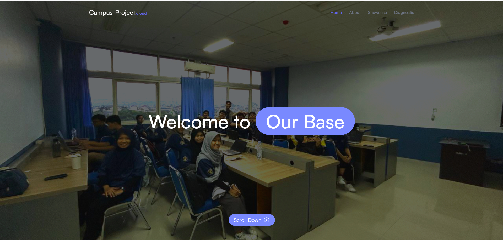
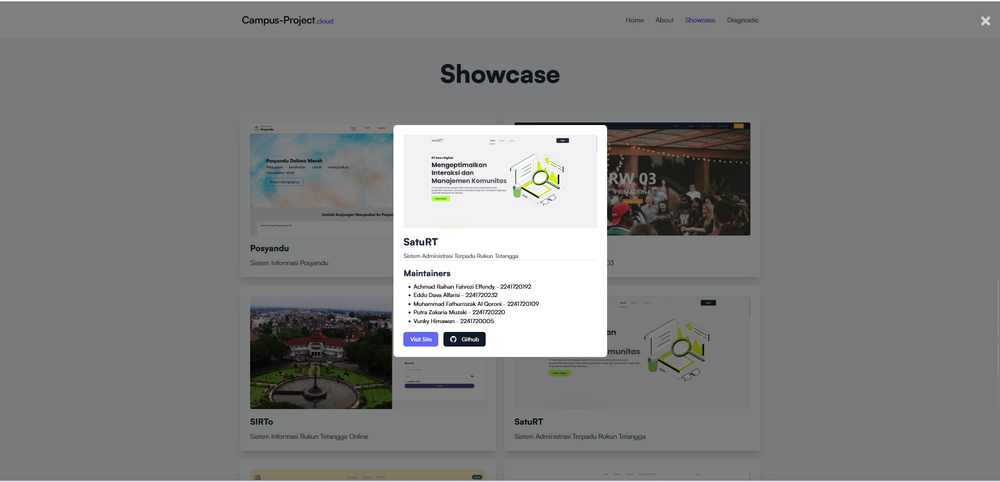

## Overview
**Campus Project** is a personal web development project designed and built as part of a college exhibition. The project showcases the development skills we acquired during the semester, using **ReactJS** and **TailwindCSS** for building interactive and responsive user interfaces. The platform provides students with key campus information, upcoming events, and resources in a visually appealing and easy-to-navigate format.

---

## 👨‍💻 Role
**Frontend Developer**

In this project, I collaborated with **Vunky Himawan** to design and develop the frontend using **ReactJS** and **TailwindCSS**. I focused on creating responsive, component-based UI elements, integrating dynamic features like the event calendar, and ensuring the design was both aesthetic and user-friendly. We leveraged **TailwindCSS** for styling and **ReactJS** to handle the app's state management and interactivity.

---

## ❓ Problem
1. **Lack of Information Platform:** Students had difficulty accessing up-to-date campus information, including event schedules and important announcements.
2. **Difficult Navigation:** Existing platforms were difficult to navigate, with limited user interaction or engagement.
3. **No Centralized Resource Hub:** Students lacked a centralized location for academic resources, clubs, and student services.

---

## 🎯 Goal
1. Build an interactive web platform using **ReactJS** and **TailwindCSS** that presents key campus information in a user-friendly way.
2. Create a responsive, mobile-first interface optimized for all devices.
3. Showcase the power of **ReactJS** for building dynamic components and **TailwindCSS** for styling with utility-first classes.

---

## ✨ Solution

### Key Features
1. **Landing Page Design:** The landing page serves as the entry point, featuring a clean and minimalistic design. It highlights key features of the project and introduces users to the campus information system.
   
2. **Event Calendar:** Using **ReactJS**, we built an interactive event calendar that displays upcoming campus events. This calendar is dynamic and allows users to interact with the dates and view event details.
   
3. **Campus Resources Hub:** A centralized section where students can find academic resources, student clubs, and links to important services, built with reusable React components for efficient development.
   
4. **Mobile-First Design with TailwindCSS:** The project is fully responsive, with a mobile-first approach, making it easy to access on any device. **TailwindCSS** was used for rapid styling, focusing on utility classes to ensure scalability and maintainability.

---

## ⚙️ Challenges and Learnings
1. **Component Reusability:** One of the challenges we faced was ensuring that the components were reusable and easy to manage across the app. We used React's component-based structure to create modular components, making the project more maintainable.
   
2. **State Management:** Handling the dynamic event data and campus resources was complex, but **React's state management** and **useContext** hook helped us manage the state efficiently across different components.
   
3. **TailwindCSS Customization:** While **TailwindCSS** provided utility-first styling, it required some time to customize certain design elements. Tailwind’s configuration file allowed us to adjust themes, colors, and breakpoints to match our design vision.
   
4. **Cross-Device Testing:** We tested the platform across different devices to ensure the app provided a consistent user experience, especially on mobile devices, as the project was built with a mobile-first approach.

---

## ✨ Final Thoughts
The **Campus Project** gave us an opportunity to apply and showcase our skills in **ReactJS** and **TailwindCSS**. It was an excellent project for demonstrating the capabilities of component-based development and utility-first CSS in a real-world context. The result is a fully responsive and dynamic web app that serves as a great tool for college students to stay informed about campus life. 

This project not only helped us solidify our knowledge of web development but also provided valuable experience in building scalable and maintainable user interfaces.

---

## Team Members
- [Achmad Raihan Fahrezi Effendy](https://github.com/raihanachmad8) as **Frontend Developer**
- [Vunky Himawan](https://github.com/vunky-himawan) as **Frontend Developer**
