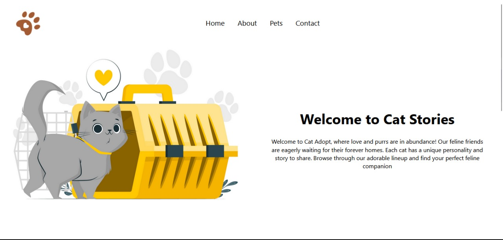
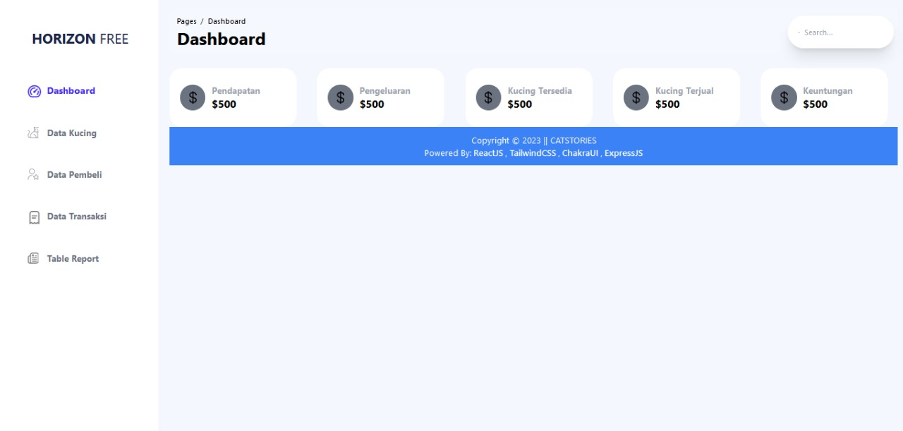
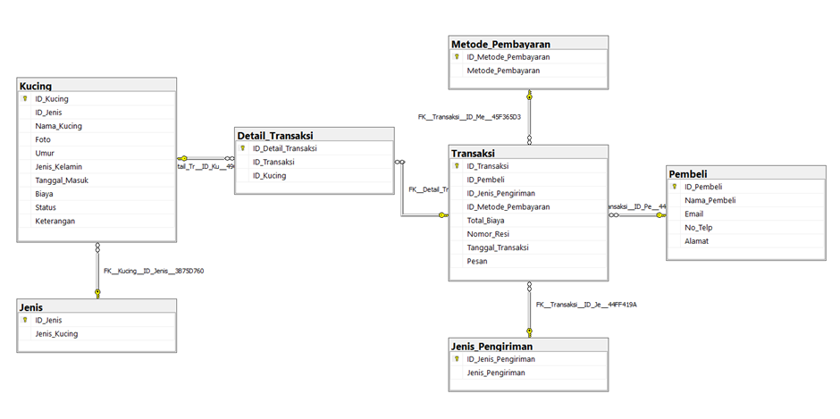

## Table of Contents
1. [Overview](#overview)
2. [Role](#role)
3. [Problem](#problem)
4. [Goal](#goal)
5. [Solution](#solution)
   - [How is the adoption data managed currently?](#how-is-the-adoption-data-managed-currently)
   - [Challenges in the Adoption Process](#challenges-in-the-adoption-process)
   - [Solution Features](#solution-features)
6. [User Testing](#user-testing)
7. [Challenges and Learnings](#challenges-and-learnings)
8. [Final Thoughts](#final-thoughts)

---

## Overview
**Cat Stories** is a web-based point of sales (POS) system designed to simplify the management of cat adoption data. Built with a **NodeJS** and **ExpressJS** backend, **ReactJS** on the frontend, and an **MSSQL** database, the application streamlines the adoption process, allowing shelters to manage and track adoption data efficiently.

The system aims to enhance the adoption experience by providing users with a simple interface to view available cats, request adoptions, and allow administrators to manage adoption data easily.

---

## 👨‍💻 Role
**Backend Programmer** and **System Analyst**

As a backend programmer and system analyst, I was responsible for:
- Designing the **backend architecture** using **ExpressJS** to handle HTTP requests.
- Implementing database schemas using **Knex.js** with **MSSQL** to store and manage adoption data.
- Analyzing system requirements and ensuring smooth integration between the frontend (ReactJS) and backend.
- Ensuring data security, query optimization, and overall system reliability.

---

## ❓ Problem
Managing cat adoption data presents several challenges:
1. **Tracking Adoption Requests:** Without an automated system, adoption requests were managed manually, leading to errors and inefficiencies.
2. **Data Integrity:** Maintaining accurate and consistent adoption data across different platforms and devices was difficult.
3. **User Experience:** The adoption process was time-consuming and lacked an easy-to-navigate system for both administrators and users.

---

## 🎯 Goal
1. Create a seamless system for managing cat adoption data.
2. Provide an intuitive interface for users to view available cats and submit adoption requests.
3. Improve administrative workflow by automating data management and offering insights into adoption trends.

---

## ✨ Solution

### How is the adoption data managed currently?
Before **Cat Stories**, adoption data was managed using spreadsheets and paper logs. There was no centralized platform for keeping track of available cats, adoption requests, or histories. The process was slow and prone to errors.

### Challenges in the Adoption Process
Some of the challenges faced in the existing process include:
1. **Manual Tracking:** Adoption data was manually entered into spreadsheets, which resulted in inconsistent records.
2. **Communication Gaps:** Users had difficulty tracking the status of adoption requests, leading to confusion.
3. **Inefficient Workflow:** Administrators struggled with managing large amounts of data without a centralized system.

### Solution Features
The **Cat Stories** platform addresses these issues with the following key features:
1. **Adoption Data Management:** A centralized database where all adoption requests, available cats, and adoption histories are stored.
2. **User Interface:** A **ReactJS** frontend that allows users to browse available cats, submit adoption requests, and view status updates.
3. **Admin Dashboard:** An administrative dashboard that enables staff to manage cat profiles, adoption statuses, and track progress.
4. **Database Integration:** **Knex.js** was used to manage the database queries with **MSSQL**, ensuring optimized data retrieval and security.

---

### Database Design
Here is a diagram illustrating the database design used for the Cat Stories system.

---

### User Journey
1. **Registration:** Users register on the website to view available cats and submit adoption requests.
2. **Browsing Available Cats:** Users browse cat profiles, view detailed information, and check adoption eligibility.
3. **Requesting Adoption:** Users submit an adoption request through the system, which is processed by administrators.
4. **Adoption Confirmation:** Once an adoption request is approved, the cat's status is updated, and both user and admin are notified.

---

## ⚙️ Challenges and Learnings
1. **Database Integration:** Ensuring smooth integration between **Knex.js** and **MSSQL** posed challenges, especially with complex queries. We optimized performance by using proper indexing and query management.
2. **User Authentication:** Implementing secure user authentication for both adopters and admins required attention to security best practices, especially in handling sensitive user data.
3. **Error Handling:** Proper error handling for database transactions was crucial in maintaining data integrity, and was a key part of the backend design.

---

## ✨ Final Thoughts
1. **Centralized Management is Key:** The shift to a centralized database and user-friendly interface has significantly streamlined the adoption process.
2. **Performance Optimization:** Optimizing queries and ensuring a smooth, fast user experience was critical in the success of this project.
3. **Future Improvements:** Based on user feedback, future improvements will focus on enhancing the mobile responsiveness of the platform and introducing advanced search functionalities for cats.

---

## Team Members
- [Achmad Raihan Fahrezi Effendy](https://github.com/raihanachmad8) as **Backend Developer**
- [Putra Zakaria Muzaki](https://github.com/PutraZakaria) as **Project Manager Developer**
- [Vunky Himawan](https://github.com/vunky-himawan) as **Front end Developer**
