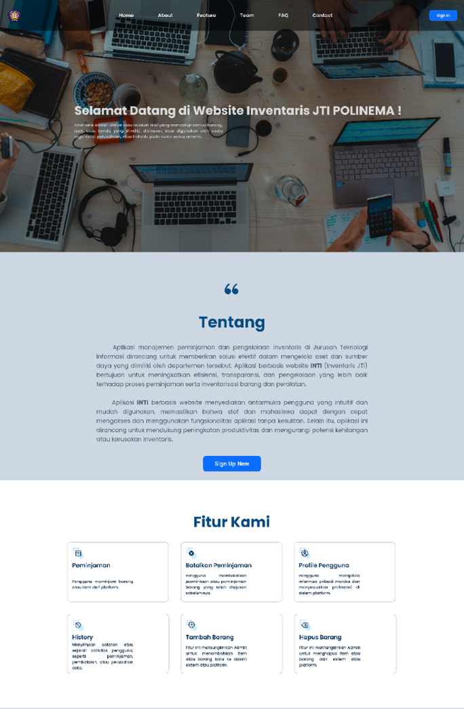
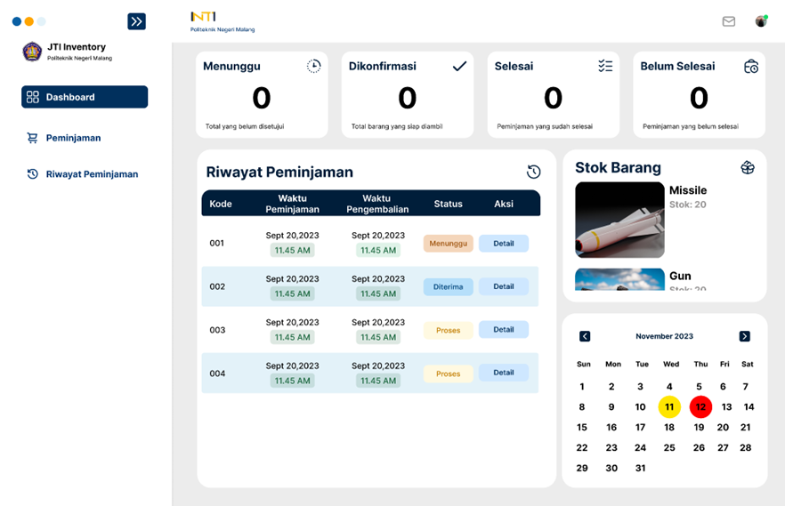
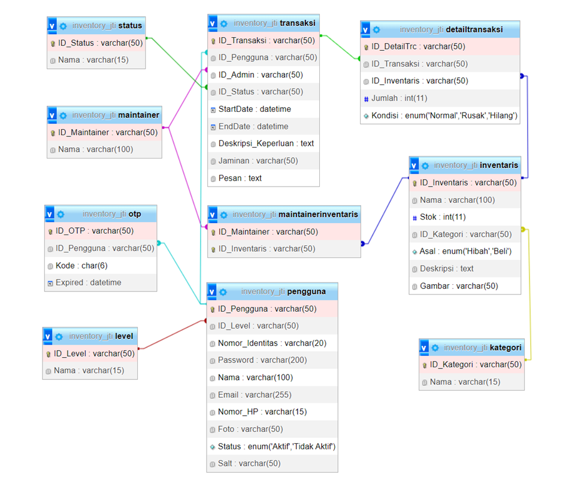
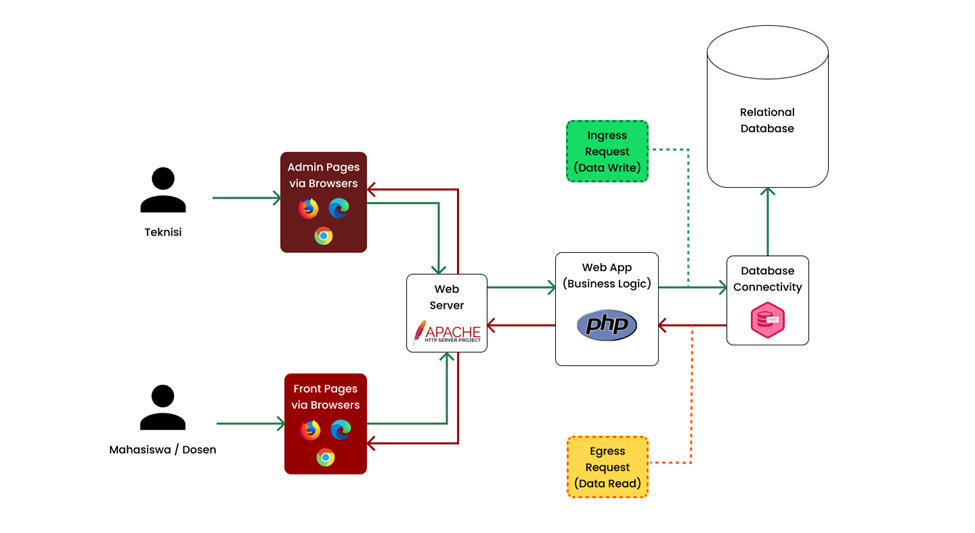

## Table of Contents
1. [Overview](#overview)
2. [Role](#role)
3. [Problem](#problem)
4. [Goal](#goal)
5. [Solution](#solution)
   - [How is inventory management handled currently?](#how-is-inventory-management-handled-currently)
   - [What challenges do users face?](#what-challenges-do-users-face)
   - [Solution Features](#solution-features)
6. [User Testing](#user-testing)
7. [Challenges and Learnings](#challenges-and-learnings)
8. [Final Thoughts](#final-thoughts)

---

## Overview
**INTI** is a web-based information system designed to streamline the management of inventory storage and lending at the **Information Technology Department** (JTI) of **Politeknik Negeri Malang**. Built using **PHP** and **Bootstrap**, the system simplifies the tracking of both inventory items and their loans, where items are requested by students and staff and loan approval is handled manually by administrators. 

The system aims to improve inventory management efficiency by providing a clear, centralized interface that enables better tracking of inventory and loan requests.

---

## 👨‍💻 Role
**Backend Developer**

As the backend developer, I was responsible for designing and implementing the core functionality of the system, including the database structure, server-side logic for inventory and loan management, and ensuring that the application handles requests and updates accurately.

---

## ❓ Problem
The Information Technology Department faces several challenges in managing inventory:
1. **Tracking Inventory:** Without a centralized system, it was difficult to maintain an accurate record of items and their usage.
2. **Managing Loan Requests:** The process of handling loan requests and approvals was manual, error-prone, and inefficient.
3. **Inconsistent Data Entry:** The lack of a standardized process for data entry resulted in inconsistencies and confusion regarding item availability.

---

## 🎯 Goal
1. Simplify the process of managing inventory and handling loan requests.
2. Provide an intuitive interface for administrators and users to interact with the inventory system.
3. Improve the efficiency of loan requests by automating certain aspects of the process, such as notifications and tracking.

---

## ✨ Solution

### How is inventory management handled currently?
Before INTI, inventory management at JTI relied on spreadsheets and manual records. There was no central system for tracking items, and loan requests were handled manually by administrators.

### What challenges do users face?
The primary challenges identified include:
1. Difficulty in knowing which items were available or already loaned out.
2. The manual process for loan requests and approvals led to delays and errors.
3. Lack of a system to track and manage requests over time.

### Solution Features
INTI was developed to address these issues with the following key features:
1. **Inventory Tracking:** Administrators can update inventory status, and users can check the availability of items through the system.
2. **Loan Request System:** Students and staff can submit loan requests, which administrators approve or reject. Requests are manually processed by admins rather than in real-time.
3. **User-Friendly Interface:** A simple, intuitive interface that enables both staff and students to easily manage inventory data and requests.

---

### Database Design
Here is a diagram illustrating the database design used for the INTI system. It shows how tables are structured to manage inventory items, users, and loan requests.

---

### System Design
The system architecture diagram provides a high-level overview of how the different components interact within the INTI system.

---

### User Journey
1. **Onboarding:** Administrators set up inventory data, and users (students and staff) can browse available items.
2. **Inventory Request:** Users submit a request for items they wish to borrow.
3. **Loan Approval:** Administrators review and approve or deny loan requests manually.
4. **Return Process:** When an item is returned, administrators update its status in the system.

---

## ⚙️ Challenges and Learnings
1. **Database Optimization:** Designing a database schema that could handle loan requests efficiently, with proper indexing, was a key challenge.
2. **Loan Request Workflow:** Simplifying the workflow for admins to approve or reject loans while maintaining control over the inventory was crucial. We optimized request handling to ensure smooth communication.
3. **Security:** Implementing secure access control to prevent unauthorized users from modifying inventory records was critical, and we added role-based permissions to handle this.

---

## ✨ Final Thoughts
1. **Manual Approvals Still Work:** Although the system doesn’t support real-time loan approvals, manual loan processing by administrators has helped maintain control over inventory usage and requests.
2. **Backend Reliability is Key:** Ensuring that backend logic for handling loan requests and inventory updates is reliable has been critical for the success of the project.
3. **Feedback-Driven Improvements:** Regular feedback from users has helped refine the system to meet both user needs and administrative requirements.

---

## Team Members
- [Achmad Raihan Fahrezi Effendy](https://github.com/raihanachmad8) as **Backend Developer**
- [Putra Zakaria Muzaki](https://github.com/PutraZakaria) as **Project Manager Developer**
- [Vunky Himawan](https://github.com/vunky-himawan) as **Frontend Developer**
- [Dela Farahita Zain](https://github.com/delafarahita) as **UI / UX Desainer**
