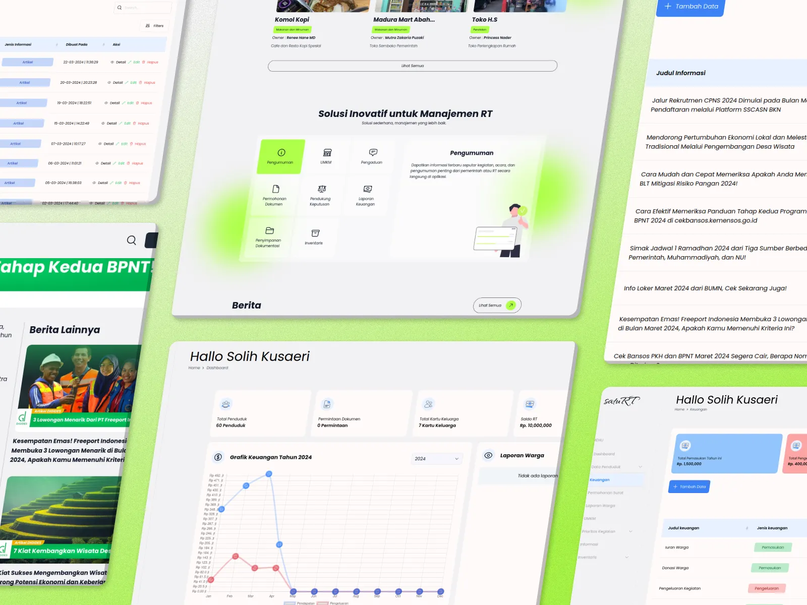

## Table of Contents
1. [Overview](#overview)
2. [Role](#role)
3. [Problem](#problem)
4. [Goal](#goal)
5. [Solution](#solution)
   - [Key Features](#key-features)
   - [User Journey](#user-journey)
6. [User Testing](#user-testing)
7. [Challenges and Learnings](#challenges-and-learnings)
8. [Final Thoughts](#final-thoughts)

---

## Overview
**SatuRT** is a web-based information system designed to optimize interaction and management at the **Rukun Tetangga (RT)** level. This project aims to facilitate better communication between residents and provide efficient management of neighborhood data. Using **PHP**, **Laravel 10**, **TailwindCSS**, and **AlpineJS**, SatuRT offers an intuitive interface and powerful functionality to help residents and administrators manage various RT-related tasks.

---

## 👨‍💻 Role
**Full Stack Developer**

In this project, I was responsible for both backend and frontend development. On the backend, I implemented the core business logic using **Laravel 10**, integrated the **authentication** system, and created database structures for **crawling data** and managing **RT residents' information**. On the frontend, I developed intuitive user interfaces with **TailwindCSS** and **AlpineJS**, ensuring seamless data presentation using **DataTables** for sorting, searching, and paginating large datasets. I also contributed to designing the **Decision Support System** (DSS) for optimal decision-making processes for RT management.

---

## ❓ Problem
The neighborhood management at the RT level faced several challenges:
1. **Inefficient Data Management:** Managing RT resident information and neighborhood data was done manually and lacked structure.
2. **Difficult Communication:** There was no centralized system to communicate updates and manage requests from residents.
3. **Data-Driven Decisions:** Decision-making processes were not optimal, lacking reliable data and decision support tools.
4. **Security and Authentication:** There was no secure system for resident authentication and access control.

---

## 🎯 Goal
1. Create a centralized platform for managing RT data, resident information, and communication.
2. Implement **DataTables** for efficient data management and easy access to large datasets.
3. Develop a **Decision Support System** to assist RT administrators in making informed decisions.
4. Implement **secure authentication** to ensure that only authorized users can access the platform.
5. Enhance the user experience with **image preview** features, including **zoom-in and zoom-out** capabilities.

---

## ✨ Solution

### Key Features
1. **DataTables for Resident Information:** I implemented **DataTables** to display large amounts of RT data efficiently, with features such as search, sort, and pagination for ease of use. 
   

2. **Crawling Data:** I developed a feature to crawl public data (like RT news, government announcements) and display it in the system for easy access by residents. This automated the process of gathering important information.

3. **Sistem Pendukung Keputusan (Decision Support System):** I designed a Decision Support System to help RT administrators make data-driven decisions on various issues, including resource allocation and event planning.
   

4. **Authentication & Security:** The system includes **user authentication** using **Laravel’s built-in authentication**, ensuring that only authorized users can access certain features like adding or modifying resident data.

5. **Mobile-First Design:** Using **TailwindCSS** and **AlpineJS**, I created a responsive and user-friendly interface, optimized for both desktop and mobile use.

6. **Image Preview (Zoom In/Out):** I enhanced the user interface by implementing an **image preview feature** with **zoom-in and zoom-out** capabilities, making it easier to interact with images such as event photos, official announcements, and documents.

### User Journey
1. **Registration and Login:** Residents register through a simple form, and RT administrators can approve or deny registrations. The login system uses **Laravel Passport** for secure authentication.
2. **Dashboard Access:** Once logged in, users can view the dashboard, which provides access to neighborhood data, decision-making tools, and communication updates.
3. **Data Interaction:** Residents can interact with **DataTables** to search for specific information about the RT, like financial reports or event updates.
4. **Decision Support:** RT administrators use the DSS tool to input data and generate recommendations based on pre-defined models.
5. **Image Interaction:** Users can zoom in and out on images for a better viewing experience, whether it's a photo from an event or an important document.

---

## 🧪 User Testing
We tested the system with 20 users (residents and RT administrators) and gathered feedback on:
- **Ease of Use:** 18/20 users found the interface intuitive and easy to navigate, especially the use of **DataTables** for resident data management.
- **Security:** 15/20 users felt secure logging into the platform with the new authentication system.
- **Decision Support System:** 14/20 administrators found the **DSS** useful for decision-making but suggested adding more data input fields for accuracy.
- **Image Preview:** 17/20 users appreciated the zoom-in/zoom-out image preview for event photos and documents.

---

## ⚙️ Challenges and Learnings
1. **Integrating Crawled Data:** One challenge was ensuring the crawled data was accurate and up-to-date. I overcame this by scheduling regular cron jobs to fetch and update data.
2. **Scalability of DataTables:** Handling large amounts of data in **DataTables** required careful optimization. I implemented server-side processing to improve performance with large datasets.
3. **User Authentication:** Ensuring a secure and seamless authentication process for residents and administrators was a priority. I used **Laravel Passport** for OAuth2 authentication to provide a secure and scalable solution.
4. **Image Loading Optimization:** The **zoom-in/zoom-out** functionality required optimizations for fast loading, especially for larger images. I used **lazy loading** to ensure that images load only when they are needed, improving overall system performance.
5. **Cross-Browser Compatibility:** Ensuring the system worked across all modern browsers, especially when using **AlpineJS** for reactive UI, was a key consideration.

---

## 📝 UAT (User Acceptance Testing)
The UAT phase involved evaluating 81 points across various aspects of the system, focusing on functionality, user experience, security, and performance. Below are some highlights:
- **Functionality:** The system passed all 6 core functional tests, ensuring that each primary feature worked as expected:
  1. DataTables features (search, sort, pagination)
  2. Image preview (zoom-in/zoom-out)
  3. User authentication and access control
  4. Decision Support System performance
  5. Data crawling accuracy
  6. Mobile responsiveness
- **Performance:** The system was evaluated for loading times and responsiveness, with particular attention to image loading times and DataTables rendering speed.
- **Security:** All user authentication and authorization mechanisms were tested, and security measures (like password hashing and data encryption) were verified.
- **Usability:** The interface was assessed for ease of navigation, accessibility, and intuitiveness. The **zoom-in/zoom-out image preview** received positive feedback for improving user interaction.

---

## ✨ Final Thoughts
1. **Automation is Key:** The use of **crawling data** greatly improved the timeliness and relevance of the information available to residents, making communication more efficient.
2. **Data-Driven Decision Making:** Implementing the **Decision Support System** empowered RT administrators to make better decisions, improving the quality of neighborhood management.
3. **Security and Performance:** Prioritizing **authentication** and optimizing the performance of **DataTables** ensures the system can scale and be secure for future growth.
4. **Enhanced Image Interaction:** Adding the image preview feature with **zoom-in/zoom-out** functionality enhances the user experience, particularly for visual-based updates and documents.
5. **Comprehensive UAT:** The extensive UAT process, with 81 points evaluated, ensured that the system met both functional and non-functional requirements, providing a reliable and user-friendly solution.

---

## Team Members
- [Achmad Raihan Fahrezi Effendy](https://github.com/raihanachmad8) as **Full Stack Developer**
- [Eddo Dava Alfarisi](https://github.com/Eddav29) as **Full Stack Developer**
- [Muhammad Fathurrozak Al Qoroni](https://github.com/AlQoronii) as **Full Stack Developer**
- [Putra Zakaria Muzaki](https://github.com/PutraZakaria) as **Full Stack Developer**
- [Vunky Himawan](https://github.com/vunky-himawan) as **Full Stack Developer**
